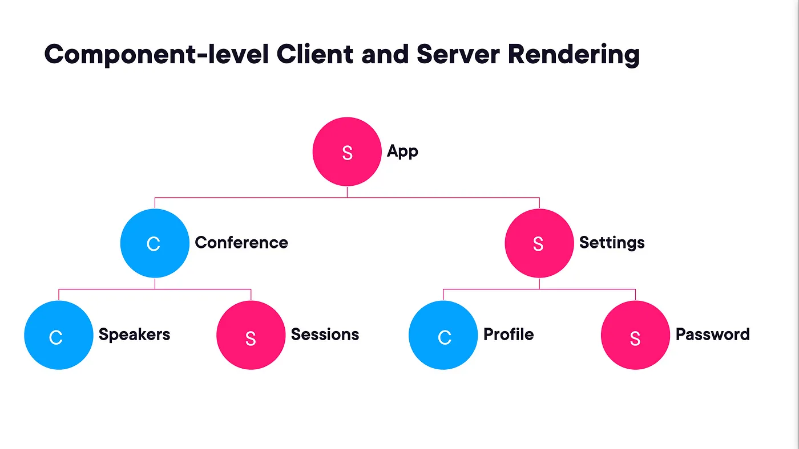

# Next 13

## Серверные и клиентские компоненты

### Правила вложения

- нельзя импортировать серверный компонент внутри клиентского
- можно пробрасывать серверные компоненты в клиентские как `children`

Используйте клиентские компоненты когда:

- необходимо использовать хуки
- когда необходимы обработчики событий на пользовательские действия
- при использовании браузерного API
- когда используется классовый компонент

Используйте серверные компоненты, когда:

- вы получаете данные через серверное API
- когда нужен прямой доступ к ресурсам бэкенда
- когда используется sensetive информация (ключи API, токены и пр.)
- когда используются тяжелые зависимости
